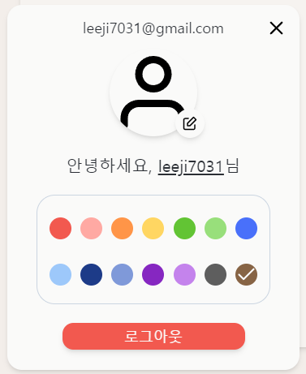
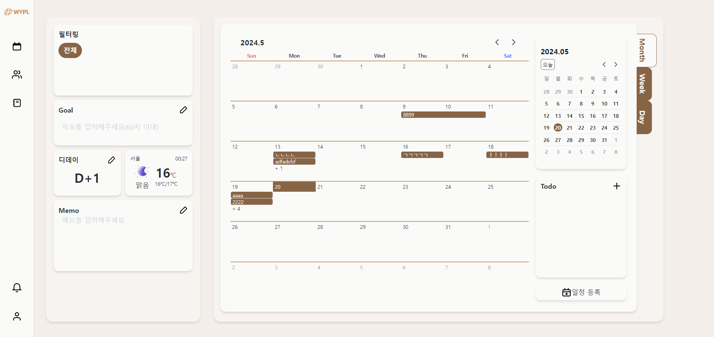
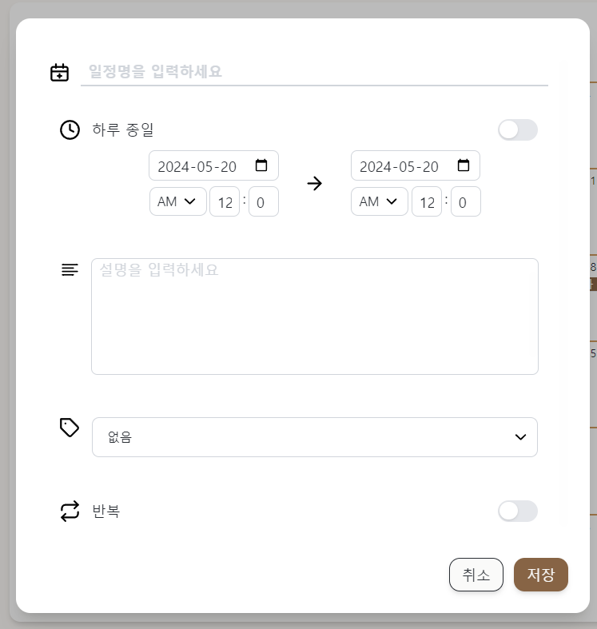
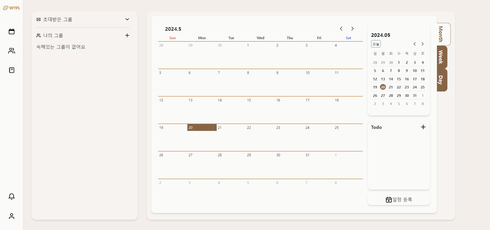
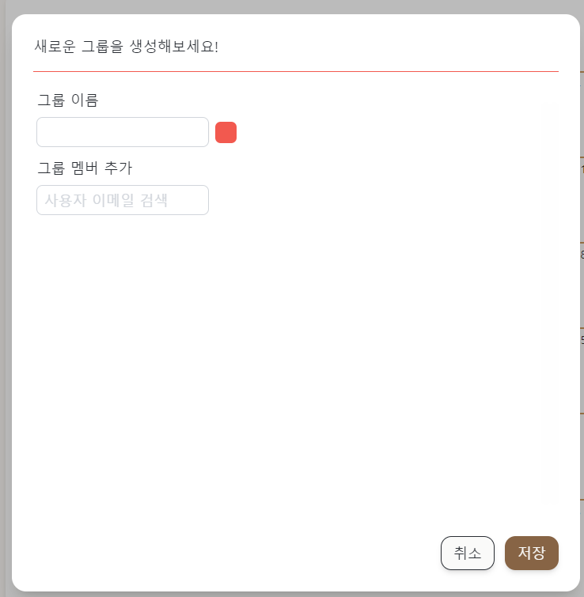
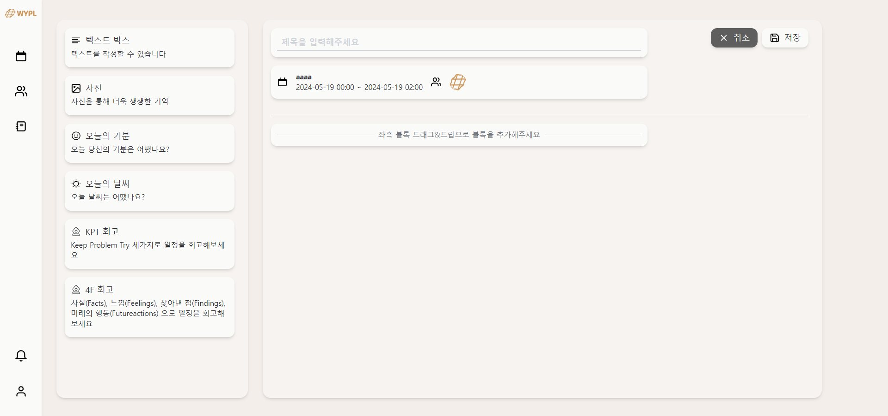

<div align="center" >
    
</div>
<div align="center">

### What's Your Plan

</div>
📢 본 프로젝트는 2024 Samsung Software Academy For Youth 10기 특화 프로젝트 일환으로 진행되었습니다.

## 서비스 소개 

단순한 일정 관리를 넘어서, 사용자가 과거의 사건, 경험, 감정 등을 기록하여 영구적으로 보존할 수 있습니다. 이를 통해 사용자는 자신의 삶을 기록하고 추억을 회상할 수 있습니다.
미래에 대한 일정을 기록하고, 다른 사용자와의 공유를 통해 일정 조율이 용이하게 합니다. 이를 통해 사용자는 개인적인 일정 뿐만 아니라, 타인과의 약속도 관리할 수 있습니다.

## 개발 기간

2024.04.08 ~ 2024.05.24 (7주)

## 팀원

<table>
  <tr>
        <td align="center" width="16%">
            <a href="https://github.com/daminzzi"></a>
            <br />
            <a href="https://github.com/daminzzi">조다민</a>
        </td>
        <td align="center" width="16%">
            <a href="https://github.com/KIMSEI1124"></a>
            <br />
            <a href="https://github.com/KIMSEI1124">김정욱</a>
        </td>
        <td align="center" width="16%">
            <a href="https://github.com/hitobi1014"></a>
            <br />
            <a href="https://github.com/hitobi1014">최민준</a>
        </td>
        <td align="center" width="16%">
            <a href="https://github.com/jiwon2121"></a>
            <br />
            <a href="https://github.com/jiwon2121">이지원</a>
        </td>
        <td align="center" width="16%">
            <a href="https://github.com/soyeonjwa"></a>
            <br />
            <a href="https://github.com/soyeonjwa">좌소연</a>
        </td>
        <td align="center" width="16%">
            <a href="https://github.com/jiwon83"></a>
            <br />
            <a href="https://github.com/jiwon83">한지원</a>
        </td>
      <tr>
        <td align="center">    
          <div><b>팀장, 프론트엔드</b></div>
          <div>SSE 알림 기능 구현</div>
          <div>회고록 작성 페이지, 드래그앤 드롭 로직 구현</div>
        </td>
        </td>
        <td align="center">
            <div><b>풀스택</b></div>
            <div>로그인 기능 구현</div>
            <div>그룹 기능 구현</div>
        </td>
        <td align="center">
            <div><b>백엔드, 인프라</b></div>
            <div>알림 시스템 구현</div>
            <div>Grapana, Prometheus 모니터링 시스템 구축</div>
        </td>
        <td align="center">
            <div><b>프론트엔드</b></div>
          <div>일정 생성, 달력 조회 기능 구현</div>
        </td>
        <td align="center">
            <div><b>백엔드</b></div>
          <div>일정 생성, 조회 기능</div>
          <div>라벨 생성, 조회 기능 구현</div>
        </td>
        <td align="center">
          <div><b>백엔드, 인프라</b></div>
          <div>그룹 기능 구현</div>
          <div>CI/CD, HTTPS, 리버스 프록시</div>
        </td>
      </tr>
  </tr>
</table>

## 기술 스택

### Front-end

<div>


</div>

### Back-end

<div>


</div>

### Infra

<div>


</div>

### 협업Tools

<div>


</div>

<br />

## 주요 기능

---
### 로그인
- 소셜 로그인을 통해 간단하게 가입, 로그인
- 소셜 로그인은 구글 로그인 가능


---
### 알림
- 그룹 초대와 같은 알림 기능 제공

---
### 내 정보
- 왼쪽 사이드바 최하단의 아이콘을 클릭하여 내 정보를 확인 가능
- 프로필 이미지를 수정 가능 
- 나의 색상을 선택하여 일정의 기본 색상을 선택 가능


---
### 개인 일정
- 개인 일정 페이지에서는 개인 일정을 월, 주, 일 단위 달력을 통해 확인 가능
- 아래의 일정 추가 버튼을 통해 일정을 추가할 수 있음


---
### 일정 등록
- 일정은 제목, 시작 날짜, 종료 날짜, 설명, 라벨, 반복을 지정 가능
- 라벨은 색과 라벨 명을 입력하여 생성 가능
- 반복은 매일, 매 주,매 월 ,매 년으로 설정 가능하며 매 주 설정은 몇 주 마다 반복할 것인지, 무슨 요일에 반복할 것인지 지정 가능


---
### 그룹 일정
- 그룹을 생성하여 그룹원을 이메일 검색을 통해 초대 가능
- 여러 그룹을 생성 가능하고 그룹별로 일정을 등록 가능



---
### 회고록
- 회고록 페이지에서 작성된 회고록을 확인 가능

---
### 회고록 작성
- 일정 상세보기에서 일정에 대한 회고록을 작성할 수 있음
- 회고록은 상단에는 일정 제목과 일정의 정보를 제공
- 왼쪽에 회고록을 간편하게 작성할 수 있는 블록 제공(기분, 날씨, 4F, KPT 등...)
- 양식은 드래그앤 드롭으로 오른쪽 회고록 작성 영역에서 커스터마이징 가능


---

## 아키텍처 다이어그램


## ERD


## CI CD pipeline


## Look Aside


## 디렉토리 구조

<h3> 
<details>
<summary>frontend</summary>
<div markdown="1">
  
```shell
📦frontend
 ┣ 📂dev-dist
 ┣ 📂dist
 ┣ 📂node_modules
 ┣ 📂public
 ┃  ┣ 📂fonts
 ┃  ┣ 📜favicon.ico
 ┃  ┣ 📜icon-192.png
 ┃  ┣ 📜icon-256.png
 ┃  ┣ 📜icon-512.png
 ┃  ┗ 📜logo.png
 ┣ 📂src
 ┃ ┣ 📂@types
 ┃ ┣ 📂assets
 ┃ ┃ ┣ 📂icons
 ┃ ┃ ┃ ┣ 📂emoji
 ┃ ┃ ┃ ┣ 📂weather
 ┃ ┃ ┣ 📂images
 ┃ ┃ ┣ 📂lottie
 ┃ ┃ ┗ 📂styles
 ┃ ┣ 📂components
 ┃ ┃ ┣ 📂animation
 ┃ ┃ ┣ 📂calendar
 ┃ ┃ ┃ ┣ 📂Daily
 ┃ ┃ ┃ ┣ 📂Monthly
 ┃ ┃ ┃ ┣ 📂Weekly
 ┃ ┃ ┣ 📂color
 ┃ ┃ ┣ 📂common
 ┃ ┃ ┣ 📂group
 ┃ ┃ ┃ ┣ 📂create
 ┃ ┃ ┃ ┣ 📂invited
 ┃ ┃ ┃ ┣ 📂list
 ┃ ┃ ┃ ┣ 📂member
 ┃ ┃ ┃ ┣ 📂update
 ┃ ┃ ┣ 📂label
 ┃ ┃ ┣ 📂navbar
 ┃ ┃ ┃ ┣ 📂common
 ┃ ┃ ┃ ┣ 📂NavEventBar
 ┃ ┃ ┃ ┣ 📂sheet
 ┃ ┃ ┃ ┃ ┣ 📂member
 ┃ ┃ ┃ ┃ ┣ 📂notification
 ┃ ┃ ┣ 📂notification
 ┃ ┃ ┣ 📂review
 ┃ ┃ ┃ ┣ 📂thumbnail
 ┃ ┃ ┃ ┣ 📂view
 ┃ ┃ ┃ ┗ 📂write
 ┃ ┃ ┣ 📂schedule
 ┃ ┃ ┣ 📂toast
 ┃ ┃ ┣ 📂tooltip
 ┃ ┃ ┗ 📂widget
 ┃ ┣ 📂constants
 ┃ ┣ 📂hooks
 ┃ ┃ ┣ 📂api
 ┃ ┣ 📂objects
 ┃ ┣ 📂pages
 ┃ ┃ ┣ 📂Landing
 ┃ ┃ ┃ ┣ 📂button
 ┃ ┃ ┣ 📂Main
 ┃ ┃ ┃ ┣ 📂Calendar
 ┃ ┃ ┃ ┣ 📂Group
 ┃ ┃ ┃ ┣ 📂Review
 ┃ ┃ ┣ 📂OAuth
 ┃ ┣ 📂routes
 ┃ ┣ 📂services
 ┃ ┃ ┣ 📂auth
 ┃ ┃ ┣ 📂calendar
 ┃ ┃ ┣ 📂group
 ┃ ┃ ┣ 📂label
 ┃ ┃ ┣ 📂member
 ┃ ┃ ┣ 📂notification
 ┃ ┃ ┣ 📂review
 ┃ ┃ ┣ 📂schedule
 ┃ ┃ ┣ 📂todo
 ┃ ┃ ┣ 📂widget
 ┃ ┣ 📂stores
 ┃ ┗ 📂utils
 ┣ 📜.eslintrc.cjs
 ┣ 📜.gitignore
 ┣ 📜.prettierrc
 ┣ 📜index.html
 ┣ 📜package-lock.json
 ┣ 📜package.json
 ┣ 📜pnpm-lock.yaml
 ┣ 📜postcss.config.js
 ┣ 📜tailwind.config.js
 ┣ 📜tsconfig.json
 ┣ 📜tsconfig.node.json
 ┗ 📜vite.config.ts
```

</div>
</details>

<h3> 
<details>
<summary>backend</summary>
<div markdown="1">

```shell
📦backend
 ┣ 📂gradle
 ┃ ┗ 📂wrapper
  📂src
   ┣ 📂main
   ┃ ┣ 📂java
   ┃ ┃ ┗ 📂com
   ┃ ┃   ┗ 📂butter
   ┃ ┃     ┗ 📂wypl
   ┃ ┃       ┣ 📂auth
   ┃ ┃       ┃ ┣ 📂annotation
   ┃ ┃       ┃ ┣ 📂controller
   ┃ ┃       ┃ ┣ 📂data
   ┃ ┃       ┃ ┃ ┣ 📂response
   ┃ ┃       ┃ ┣ 📂domain
   ┃ ┃       ┃ ┣ 📂exception
   ┃ ┃       ┃ ┣ 📂mock
   ┃ ┃       ┃ ┣ 📂properties
   ┃ ┃       ┃ ┣ 📂service
   ┃ ┃       ┃ ┗ 📂utils
   ┃ ┃       ┣ 📂calendar
   ┃ ┃       ┃ ┣ 📂controller
   ┃ ┃       ┃ ┣ 📂data
   ┃ ┃       ┃ ┃ ┣ 📂response
   ┃ ┃       ┃ ┣ 📂exception
   ┃ ┃       ┃ ┗ 📂service
   ┃ ┃       ┣ 📂file
   ┃ ┃       ┃ ┣ 📂controller
   ┃ ┃       ┃ ┣ 📂data
   ┃ ┃       ┃ ┃ ┗ 📂response
   ┃ ┃       ┃ ┣ 📂exception
   ┃ ┃       ┃ ┣ 📂service
   ┃ ┃       ┣ 📂global
   ┃ ┃       ┃ ┣ 📂annotation
   ┃ ┃       ┃ ┣ 📂common
   ┃ ┃       ┃ ┃ ┣ 📂controller
   ┃ ┃       ┃ ┃ ┣ 📂interceptor
   ┃ ┃       ┃ ┣ 📂config
   ┃ ┃       ┃ ┃ ┣ 📂dev
   ┃ ┃       ┃ ┃ ┣ 📂local
   ┃ ┃       ┃ ┃ ┃ ┗ 📂redis
   ┃ ┃       ┃ ┣ 📂exception
   ┃ ┃       ┃ ┃ ┗ 📂controller
   ┃ ┃       ┃ ┣ 📂utils
   ┃ ┃       ┃ ┗ 📂validator
   ┃ ┃       ┣ 📂group
   ┃ ┃       ┃ ┣ 📂controller
   ┃ ┃       ┃ ┣ 📂data
   ┃ ┃       ┃ ┃ ┣ 📂request
   ┃ ┃       ┃ ┃ ┗ 📂response
   ┃ ┃       ┃ ┣ 📂domain
   ┃ ┃       ┃ ┣ 📂exception
   ┃ ┃       ┃ ┣ 📂repository
   ┃ ┃       ┃ ┃ ┗ 📂query
   ┃ ┃       ┃ ┣ 📂service
   ┃ ┃       ┃ ┗ 📂utils
   ┃ ┃       ┣ 📂infrastructure
   ┃ ┃       ┃ ┣ 📂exception
   ┃ ┃       ┃ ┣ 📂ouath
   ┃ ┃       ┃ ┃ ┣ 📂google
   ┃ ┃       ┃ ┗ 📂weather
   ┃ ┃       ┃ ┃ ┣ 📂data
   ┃ ┃       ┃ ┃ ┗ 📂properties
   ┃ ┃       ┣ 📂label
   ┃ ┃       ┃ ┣ 📂controller
   ┃ ┃       ┃ ┣ 📂data
   ┃ ┃       ┃ ┃ ┣ 📂request
   ┃ ┃       ┃ ┃ ┗ 📂response
   ┃ ┃       ┃ ┣ 📂domain
   ┃ ┃       ┃ ┣ 📂exception
   ┃ ┃       ┃ ┣ 📂repository
   ┃ ┃       ┃ ┣ 📂service
   ┃ ┃       ┃ ┗ 📂utils
   ┃ ┃       ┣ 📂member
   ┃ ┃       ┃ ┣ 📂controller
   ┃ ┃       ┃ ┣ 📂data
   ┃ ┃       ┃ ┃ ┣ 📂request
   ┃ ┃       ┃ ┃ ┣ 📂response
   ┃ ┃       ┃ ┣ 📂domain
   ┃ ┃       ┃ ┣ 📂exception
   ┃ ┃       ┃ ┣ 📂repository
   ┃ ┃       ┃ ┃ ┣ 📂query
   ┃ ┃       ┃ ┃ ┃ ┗ 📂data
   ┃ ┃       ┃ ┣ 📂service
   ┃ ┃       ┃ ┗ 📂utils
   ┃ ┃       ┣ 📂notification
   ┃ ┃       ┃ ┣ 📂controller
   ┃ ┃       ┃ ┣ 📂data
   ┃ ┃       ┃ ┃ ┣ 📂request
   ┃ ┃       ┃ ┃ ┣ 📂response
   ┃ ┃       ┃ ┣ 📂domain
   ┃ ┃       ┃ ┣ 📂exception
   ┃ ┃       ┃ ┣ 📂repository
   ┃ ┃       ┃ ┗ 📂service
   ┃ ┃       ┣ 📂review
   ┃ ┃       ┃ ┣ 📂controller
   ┃ ┃       ┃ ┣ 📂data
   ┃ ┃       ┃ ┃ ┣ 📂request
   ┃ ┃       ┃ ┃ ┗ 📂response
   ┃ ┃       ┃ ┣ 📂domain
   ┃ ┃       ┃ ┣ 📂exception
   ┃ ┃       ┃ ┣ 📂repository
   ┃ ┃       ┃ ┗ 📂service
   ┃ ┃       ┣ 📂schedule
   ┃ ┃       ┃ ┣ 📂controller
   ┃ ┃       ┃ ┣ 📂data
   ┃ ┃       ┃ ┃ ┣ 📂request
   ┃ ┃       ┃ ┃ ┣ 📂response
   ┃ ┃       ┃ ┣ 📂domain
   ┃ ┃       ┃ ┣ 📂exception
   ┃ ┃       ┃ ┣ 📂respository
   ┃ ┃       ┃ ┃ ┣ 📂query
   ┃ ┃       ┃ ┣ 📂service
   ┃ ┃       ┃ ┗ 📂utils
   ┃ ┃       ┣ 📂scheduler
   ┃ ┃       ┃ ┗ 📂service
   ┃ ┃       ┣ 📂sidetab
   ┃ ┃       ┃ ┣ 📂controller
   ┃ ┃       ┃ ┣ 📂data
   ┃ ┃       ┃ ┃ ┣ 📂request
   ┃ ┃       ┃ ┃ ┗ 📂response
   ┃ ┃       ┃ ┣ 📂domain
   ┃ ┃       ┃ ┃ ┣ 📂cache
   ┃ ┃       ┃ ┃ ┣ 📂embedded
   ┃ ┃       ┃ ┣ 📂exception
   ┃ ┃       ┃ ┣ 📂repository
   ┃ ┃       ┃ ┣ 📂service
   ┃ ┃       ┃ ┗ 📂utils
   ┃ ┃       ┗ 📂todo
   ┃ ┃         ┣ 📂controller
   ┃ ┃         ┣ 📂data
   ┃ ┃         ┃ ┣ 📂request
   ┃ ┃         ┃ ┗ 📂response
   ┃ ┃         ┣ 📂domain
   ┃ ┃         ┣ 📂exception
   ┃ ┃         ┣ 📂repository
   ┃ ┃         ┣ 📂service
   ┃ ┃         ┗ 📂utils
   ┃ ┗ 📂resources
   ┃   ┣ 📂db
   ┃   ┃ ┗ 📂migration
   ┃   ┣ 📂security
   ┃   ┗ 📂static
   ┃     ┗ 📂swagger-ui
   ┗ 📂test
     ┣ 📂java
     ┃ ┗ 📂com
     ┃   ┗ 📂butter
     ┃     ┗ 📂wypl
     ┃       ┣ 📂auth
     ┃       ┃ ┣ 📂annotation
     ┃       ┃ ┣ 📂controller
     ┃       ┃ ┣ 📂domain
     ┃       ┃ ┣ 📂fixture
     ┃       ┃ ┣ 📂service
     ┃       ┃ ┗ 📂utils
     ┃       ┣ 📂calendar
     ┃       ┃ ┣ 📂controller
     ┃       ┃ ┗ 📂service
     ┃       ┣ 📂file
     ┃       ┃ ┣ 📂controller
     ┃       ┃ ┣ 📂fixture
     ┃       ┃ ┣ 📂service
     ┃       ┣ 📂global
     ┃       ┃ ┣ 📂annotation
     ┃       ┃ ┣ 📂common
     ┃       ┃ ┃ ┣ 📂controller
     ┃       ┃ ┣ 📂config
     ┃       ┃ ┣ 📂utils
     ┃       ┃ ┗ 📂validator
     ┃       ┣ 📂group
     ┃       ┃ ┣ 📂controller
     ┃       ┃ ┣ 📂domain
     ┃       ┃ ┣ 📂fixture
     ┃       ┃ ┣ 📂repository
     ┃       ┃ ┣ 📂service
     ┃       ┃ ┗ 📂utils
     ┃       ┣ 📂infrastructure
     ┃       ┃ ┣ 📂ouath
     ┃       ┃ ┃ ┗ 📂google
     ┃       ┃ ┗ 📂weather
     ┃       ┣ 📂label
     ┃       ┃ ┣ 📂controller
     ┃       ┃ ┣ 📂domain
     ┃       ┃ ┣ 📂fixture
     ┃       ┃ ┣ 📂repository
     ┃       ┃ ┗ 📂service
     ┃       ┣ 📂member
     ┃       ┃ ┣ 📂controller
     ┃       ┃ ┣ 📂domain
     ┃       ┃ ┣ 📂fixture
     ┃       ┃ ┣ 📂repository
     ┃       ┃ ┃ ┗ 📂query
     ┃       ┃ ┣ 📂service
     ┃       ┃ ┗ 📂utils
     ┃       ┣ 📂notification
     ┃       ┃ ┣ 📂controller
     ┃       ┃ ┣ 📂fixture
     ┃       ┃ ┣ 📂repository
     ┃       ┃ ┗ 📂service
     ┃       ┣ 📂review
     ┃       ┃ ┣ 📂controller
     ┃       ┃ ┣ 📂fixture
     ┃       ┃ ┣ 📂repository
     ┃       ┃ ┗ 📂service
     ┃       ┣ 📂schedule
     ┃       ┃ ┣ 📂controller
     ┃       ┃ ┣ 📂domain
     ┃       ┃ ┣ 📂fixture
     ┃       ┃ ┃ ┗ 📂embedded
     ┃       ┃ ┣ 📂repository
     ┃       ┃ ┣ 📂respository
     ┃       ┃ ┃ ┗ 📂query
     ┃       ┃ ┣ 📂service
     ┃       ┃ ┗ 📂utils
     ┃       ┣ 📂scheduler
     ┃       ┃ ┗ 📂service
     ┃       ┣ 📂sidetab
     ┃       ┃ ┣ 📂controller
     ┃       ┃ ┣ 📂domain
     ┃       ┃ ┃ ┣ 📂embedded
     ┃       ┃ ┣ 📂fixture
     ┃       ┃ ┣ 📂repository
     ┃       ┃ ┗ 📂service
     ┃       ┗ 📂todo
     ┃         ┣ 📂controller
     ┃         ┣ 📂fixture
     ┃         ┣ 📂repository
     ┃         ┗ 📂service
     ┗ 📂resources
       ┣ 📂image
       ┗ 📂security
  ```
  
</div>
</details>
