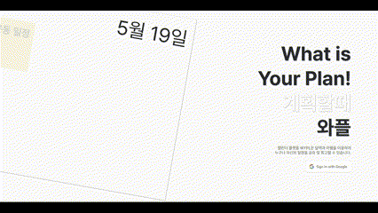
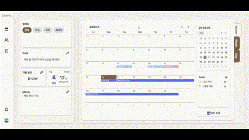
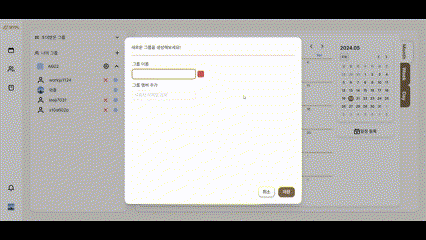

## 로그인

1. 로그인 화면에서 google 로그인 버튼을 클릭한다.
2. 권한 허용을 한다.
3. 로그인 완료

## 메인

### 메인페이지 위젯
> 목표 및 디데이 설정

메인페이지 좌측 위젯탭에서 Goal, 디데이, 날씨, 메모 위젯을 사용할 수 있다.
1. 메인페이지에서 Goal, 디데이, 메모 위젯에서 연필 버튼 클릭하여 작성모드로 진입한다.
2. 작성 완료 후 디스크 버튼을 클릭하여 저장한다.

> TODO 작성

메인페이지 우측 하단 위젯 TODO 위젯을 활용하여 TODO를 작성할 수 있다.
1. 메인페이지에서 Todo 위젯 '+' 버튼을 클릭하여 TODO를 작성한다.
2. 작성 된 TODO를 클릭하면 수정이 가능하고, 'X' 버튼을 누르면 삭제가 가능하다.

> 메인페이지 Month, Week, Day

사진 추가예정

1. 메인페이지 캘린더 우측 Month, Week, Day 인덱스 버튼을 활용하여 등록된 일정을 필터링하여 조회할 수 있다.

## 일정
> 개인 일정 (반복일정 등록)

메인페이지 일정등록을 통해 개인일정을 등록하고, 반복 토글버튼을 이용해 일정 반복일정을 생성할 수 있다.
1. 메인페이지 우측 하단 일정 등록 버튼을 클릭한다.
2. 제목, 시간, 내용 입력 후 반복 토글 버튼을 활성화하여 반복 주기를 선택한다.
3. 작성이 완료되면 해당 반복주기만큼 일정이 생성된다.

> 일정 수정 및 삭제

일정을 클릭해 일정 상세보기에서 일정을 수정하거나 삭제할 수 있다.
1. 일정 상세보기 모달에서 우 상단 편집 버튼을 클릭하여 일정을 수정할 수 있다.
2. 일정 상세보기 모달에서 우 상단 저장 버튼을 클릭하여 일정을 저장할 수 있다.

## 그룹
> 그룹 생성

1. 사이드탭에서 '사람 로고' 클릭 후 그룹 페이지로 이동한다.
2. '나의 그룹' 우측에 있는 '+' 버튼 클릭 후 그룹 생성 페이지를 연다.
3. 사용하려는 그룹명과 그룹 색상 지정 후 해당 서비스에 가입한 회원을 검색한다.
4. 초대하려는 인원 선택 후 저장을 누른다

> 그룹초대수락

1. 사이드탭 좌측하단에 '알림 로고' 클릭 후 알림창을 띄운다.
2. 그룹 초대 알림 확인 후 수락 또는 거부버튼을 누른다.
   
> 그룹 일정

1. 그룹 페이지로 이동 후 일정 등록 버튼을 클릭한다.
2. 일정을 등록한다.
3. 등록이 완료되면 같은 그룹에 속한 인원들은 그룹페이지 및 메인페이지에서 일정을 확인할 수 있다.

## 회고

> 회고작성

일정에 대해 회고를 작성한다.
1. 회고 작성을 원하는 일정 클릭 후 회고 작성 페이지로 이동한다.
2. 좌측 사이드탭에 있는 위젯을 드래그 & 드랍하여 본문에 삽입 후 내용 작성한다.
3. 작성 완료 후 저장

> 회고목록 조회

작성한 회고목록을 조회한다.
1. 좌측 사이드탭에서 책 버튼을 클릭 후 회고 목록 페이지로 이동한다.
2. 작성한 회고들이 시간순으로 조회된다.
